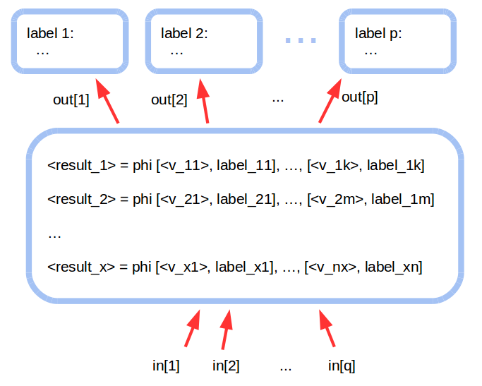

### Compiler Passes for LLvm analysis [Link](https://ucsd-pl.github.io/cse231/wi17/part3.html)

1. **Liveness Analysis**

  In this project we implement a liveness analysis on the functional analysis segment of an LLVM compiler. For any compiler pass a variable is live at a particular point in the program if its value at that point will be used in the future. It is dead otherwise.
   
2. **May-point-to Analysis**

   For this analysis, only memory objects allocated locally by LLVM IR instruction alloca can be pointees. A pointer can be either an LLVM IR variable of some pointer type (IR pointer), or a memory object (memory pointer). The analysis considers a pointer points to a memory object as long as the pointer points to any part of the object. Also, a memory object may contain multiple pointers (For example, a C struct that constains int * p1 and char * p2). The analysis considers such a memory object as one memory pointer and it may point to the union of the the memory objects that the pointers inside of it may point to. DFA identifiers are used to reference IR pointers and memory objects: The DFA identifier of a IR pointer is Ri where i is the index of the defining IR instruction of this IR pointer (IR variable). The DFA identifier of a memory object is Mi where i is the index of the IR instruction that allocates this memory object. For example, suppose that the following IR instruction's index is 10
```
%ptr = alloca i32, i32 4

```
then the DFA identifier of the IR pointer, %ptr, created by this instruction is R10, and the DFA identifier of the memory object allocated by this instruction is M10.
Let Pointers be the set of the DFA identifiers of the pointers in the function (including IR pointers and memory pointers) and MemoryObjects the set of the DFA identifiers of the memory objects allocated in the function. The domain D for this analysis is Powerset(S), where S={p → o | p ∊ Pointers && o ∊ MemoryObjects}. The bottom is the empty set. The top is S. ⊑ is ⊆ ("is subset of").





## Configuration
Install Docker, and follow [this](https://ucsd-pl.github.io/cse231/wi20/part0.html) tutorial

## Useful Tips
There are several commands that might be useful:

* Generate .ll file for a C++ program
```
clang -O0 -S -emit-llvm input.cpp
```

* Run passes 
```
opt -load [.so file] -[pass name] < [.ll file] > /dev/null
opt -load LLVMPart1.so -cse231-csi < input.ll > /dev/null
```

* Generate .bc file
```
clang++ -c -O0 -emit-llvm phi.cpp -o phi.bc
opt -load LLVMPart2.so -cse231-cdi < input.bc -o input-instrumented.bc
```

